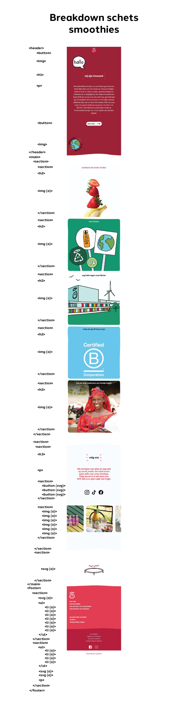

# Procesverslag
Markdown is een simpele manier om HTML te schrijven.  
Markdown cheat cheet: [Hulp bij het schrijven van Markdown](https://github.com/adam-p/markdown-here/wiki/Markdown-Cheatsheet).

Nb. De standaardstructuur en de spartaanse opmaak van de README.md zijn helemaal prima. Het gaat om de inhoud van je procesverslag. Besteedt de tijd voor pracht en praal aan je website.

Nb. Door *open* toe te voegen aan een *details* element kun je deze standaard open zetten. Fijn om dat steeds voor de relevante stuk(ken) te doen.

## Jij

  
uitwerken voor kick-off werkgroep

  ### Auteur:
  Victor van der Zwaag

  #### Je startniveau:
  blauw

  #### Je focus:
  surface plane
 

## Je website

  ### Je opdracht:
  [link naar de website die je gaat namaken óf de naam/omschrijving van je eigen ontwerp](https://www.innocentdrinks.nl/home)

  #### Screenshot(s) van de eerste pagina (small screen): 
  smoothies
  

  #### Screenshot(s) van de tweede pagina (small screen):
  hier de naam van de pagina  
  
 

## Toegankelijkheidstest 1/2 (week 1)

  
uitwerken na test in 2e werkgroep

  ### Bevindingen
  Lijst met je bevindingen die in de test naar voren kwamen:

  Content:

  De teksten en de afbeelding op de homepagina van innocent zijn logisch en duidelijk geformuleerd.
  Niet alle links, knoppen en afbeeldinge hebben een logische unieke beschrijving dus dit is niet helemaal toegankelijk.

  Global code:

  Ik heb de HTML door de w3c validater gehaald en deze wordt goedgekeurd.
  Het lang attribute wordt in het html element gebruikt.
  De namen van de verschillende pagina's zijn uniek en verschillen.
  Ook de viewport zoom is ingeschakelt op deze website.

  Keyboard:

  Het is niet altijd duidelijk wel element de tab/ shift + tab key aanduiden maar links onderin het scherm is staat wel elke keer een beschrijving van het element. Daarnaast krijg je bij de meeste elementen een wit met blauw omlijnde cirkel te zien zodat duidelijk is waar het om gaat.
  De focus volgorde komt wel overeen met de visuele layout.

  Mobile and touch:

  De website draait mee zodra ik de telefoon kantel.
  Er is geen sprake van horizontaal scrollen op de innocent home pagina.
  Alle knoppen en link-items op de website kunnen met gemak geactiveerd worden.
  Er zijn niet heel veel interactieve elementen waardoor er genoeg ruimte is om te scrollen.

  Headings:

  Er staat geen h1 op de home pagina verder worden titels wel met een h element aangegeven.
  Op de home pagina wordt geen h1 element gebruikt.
  Er is geen logische h element volgorde.
  Heading levels worden in dit geval dus wel overgeslagen.

  Lists:

  List elementen worden wel op de juiste manier toegepast.

  Images:
  Niet alle afbeeldingen hebben een alt attribute.
  Sommige decoratieve afbeeldingen hebben geen lege alt waarde.
  Er is geen sprake van een complexe afbeelding op deze pagina.
  Dit is ook niet altijd het geval.

  Media (video and audio):

  In dit geval is er geen video of audio content op de website.

  Controls:

  Het a element wordt wel voor alle links gebruikt.
  De links zijn ook herkenbaar als links.
  De controls hebben ook een focus state.
  Het button element wordt ook voor alle buttons gebruikt.
  Er is geen skip link op deze pagina.
  Deze worden niet anders vormgegeven of beschreven.

  Appearance:

  Er is geen darkmode voor deze website.
  Verder heeft de website ook geen high-contrast mode en sommigen delen hebben slecht contrast.
  Dit is niet mogelijk op de website.
  Er is weinig andere opmaak dan kleur op de website.

  Animation:

  De animaties op de website zijn allemaal erg subtiel en hebben geen flash effect.
  Er is geen background video op deze pagina.
  Er veranderd niks als ik de reduced-motion media query inschakel.

  Color contrast:

  Niet al het contrast van tekst is goed zichtbaar voor iedereen.
  Het contrast voor de grote teksten is ook niet altijd even goed.
  De iconen op de website hebben in tegenstelling tot de tekst wel een goed contrast.
  Op 1 geval na zijn deze allemaal goed te lezen.

## Breakdownschets (week 1)

  
uitwerken na afloop 3e werkgroep

  ### de hele pagina: 
  

  ### dynamisch deel (bijv menu): 
  

  ### wellicht nog een dynamisch deel (bijv filter): 
  

## Voortgang 1 (week 2)

  
uitwerken voor 1e voortgang

  ### Stand van zaken
  hier dit ging goed & dit was lastig (neem ook screenshots op van delen van je website en code)

  ### Agenda voor meeting
  samen met je groepje opstellen

  | Victor van der Zwaag
  | ---           
  | Vragen over de section/article/div elementen.
  | Vraag hoe je een screenshot van een volledige pagina kan maken.
  | Vragen over hoe ik het beste verschillende elementen kan aanroepen zonder class te gebruiken.
  | Vragen over hoe ik een font van een andere website in mijn html moet zetten.      

  ### Verslag van meeting
  hier na afloop snel de uitkomsten van de meeting vastleggen

  Ik was bij deze meeting de enigen van mijn groep die was komen opdagen.
  Ik heb uitleg gekregen over alle vragen die hierboven benoemd zijn.
  Ik heb ook een kleine toelichting gekregen over hoe ik elementen kan vinden door de inspector tool te gebruiken.

## Voortgang 2 (week 3)

  
uitwerken voor 2e voortgang

  ### Stand van zaken
  hier dit ging goed & dit was lastig (neem ook screenshots op van delen van je website en code)

  ### Agenda voor meeting
  samen met je groepje opstellen

  | Victor van der Zwaag     | Jaydey
  | ---              
  | Vragen of mijn breackdownschets moet kloppen als ik erachter kom dat deze in eerste instantie niet goed was.
  | Vraag waarom mijn site andere kleuren heeft met dezelfde hexcode.
  | Vragen hoe ik mijn html pagina moest ordenen om structuur te krijgen.
  | Vraag hoe ik elementen moet aanroepen op een tweede pagina zonder class te gebruiken.
  | Vraag hoe ik de terug naar boven svg animatie in mijn site moet inplementeren.
  | Vragen over hoe ik een svg element in mijn pagina moest zetten.

  ### Verslag van meeting
  hier na afloop snel de uitkomsten van de meeting vastleggen

  Dit keer was Jaydey er ook bij deze had echter niet echt vragen aangezien ze nog geen css opmaak had gedaan.
  Ik heb uitleg gekregen over alle vragen die hierboven benoemd zijn.

## Toegankelijkheidstest 2/2 (week 4)

  
uitwerken na test in 9e werkgroep

  ### Bevindingen
  Lijst met je bevindingen die in de test naar voren kwamen (geef ook aan wat er verbeterd is):

  Content:

  De teksten en de afbeelding op de homepagina van innocent zijn logisch en duidelijk geformuleerd.
  Alle links en knoppen op de home-pagina zijn logisch beschreven maar niet alles op de tweede pagina.

  Global code:

  Ik heb de HTML door de w3c validater gehaald en deze wordt goedgekeurd.
  Het lang attribute wordt in het html element gebruikt.
  De namen van de verschillende pagina's zijn uniek en verschillen.

  Keyboard:

  Bij het gebruik van de tab key slaat deze af en toe elementen over. Het is niet altijd duidelijk wel element de tab/ shift + tab key aanduiden maar links onderin het scherm is staat wel elke keer een beschrijving van het element. Daarnaast krijg je bij de meeste elementen een wit met blauw omlijnde cirkel te zien zodat duidelijk is waar het om gaat.
  De focus volgorde komt wel overeen met de visuele layout.

  Mobile and touch:

  De website draait mee zodra ik de telefoon kantel alleen is de opmaak dan niet altijd mooi vormgegeven.
  Er is geen sprake van horizontaal scrollen op de innocent home pagina.
  Niet alle knoppen op de website kunnen geactiveerd worden maar deze hebben wel een size en positie die toegankelijk zijn.
  Er zijn niet heel veel interactieve elementen waardoor er genoeg ruimte is om te scrollen.

  Headings:

  Er staat wel een h1 op de home pagina.
  h elementen worden goed toegepast.
  Er is wel een logische h element volgorde.
  Heading levels worden niet overgeslagen..

  Lists:

  List elementen worden wel op de juiste manier toegepast.

  Images:
  Niet alle afbeeldingen hebben een alt attribute.
  Sommige decoratieve afbeeldingen hebben geen lege alt waarde.
  Er is geen sprake van een complexe afbeelding op deze pagina.
  Niet alle afbeeldingen met tekst geven tekst aan.

  Media (video and audio):

  In dit geval is er geen video of audio content op de website.

  Controls:

  Het a element wordt wel voor alle links gebruikt.
  De links zijn ook herkenbaar als links.
  De controls hebben helaas niet altijd een focus state.
  Het button element wordt ook voor alle buttons gebruikt.
  Er is geen skip link op deze pagina.
  links die naar een nieuwe tab gaan worden niet anders vormgegeven of beschreven.

  Appearance:

  Er is geen darkmode voor deze website.
  Verder heeft de website ook geen high-contrast mode en sommigen delen hebben slecht contrast.
  Dit is niet mogelijk op de website.
  Er is weinig andere opmaak dan kleur op de website.

  Animation:

  De animaties op de website zijn allemaal erg subtiel en hebben geen flash effect.
  Er is geen background video op deze pagina.
  Er veranderd niks als ik de reduced-motion media query inschakel.

  Color contrast:

  Niet al het contrast van tekst is goed zichtbaar voor iedereen.
  Het contrast voor de grote teksten is ook niet altijd even goed.
  De iconen op de website hebben in tegenstelling tot de tekst wel een goed contrast.
  Op 1 geval na zijn deze allemaal goed te lezen.

## Voortgang 3 (week 4)

  
uitwerken voor 3e voortgang

  ### Stand van zaken
  hier dit ging goed & dit was lastig (neem ook screenshots op van delen van je website en code)

  ### Agenda voor meeting
  samen met je groepje opstellen

  | Victor van der Zwaag   | Mees     
  | ---          
  | Vragen over hoe ik de kleuren van een overgenomen svg element moet aanpassen.
  | Vraag waarom mijn hamburger menu niet werkten.
  | Vraag waarom het menu knopje blijft verspringen.
  | Vragen over hoe ik de svg animatie moet maken op mijn site.
  | Vragen hoe mijn readme er uit moest komen te zien.
  | Vragen over de inspector tool      

  ### Verslag van meeting
  hier na afloop snel de uitkomsten van de meeting vastleggen

  Dit keer was Mees erbij maar deze liep erg achter en had geen vragen voorbereid.
  Ik heb uitleg gekregen over alle vragen die hierboven benoemd zijn.
  Het was wel frustrerend om erachter te komen dat mijn hamburger menu niet werkten omdat het js.script element op de verkeerde plek stond.

## Eindgesprek (week 5)

  
uitwerken voor eindgesprek

  ### Je uitkomst - karakteristiek screenshots:
  

  ### Dit ging goed/Heb ik geleerd: 
  Korte omschrijving met plaatjes

  

  ### Dit was lastig/Is niet gelukt:
  Korte omschrijving met plaatjes

  

## Bronnenlijst

  
continu bijhouden terwijl je werkt

  Nb. Wees specifiek ('css-tricks' als bron is bijv. niet specifiek genoeg). 
  Nb. ChatGpT en andere AI horen er ook bij.
  Nb. Vermeld de bronnen ook in je code.

  1. OpenAI. 2024. ChatGPT (december) [Large language model]. chat.openai.com/chat.
  2. MDN Web Docs. (z.d.). MDN Web Docs. https://developer.mozilla.org/en-US/
  3. codepen. 2024. codepen.io (december) https://codepen.io/shooft/pen/yLKjzWa

